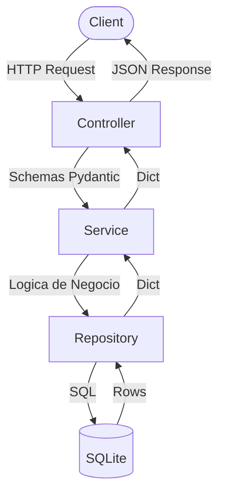
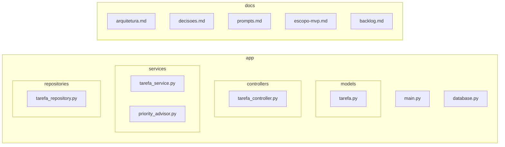
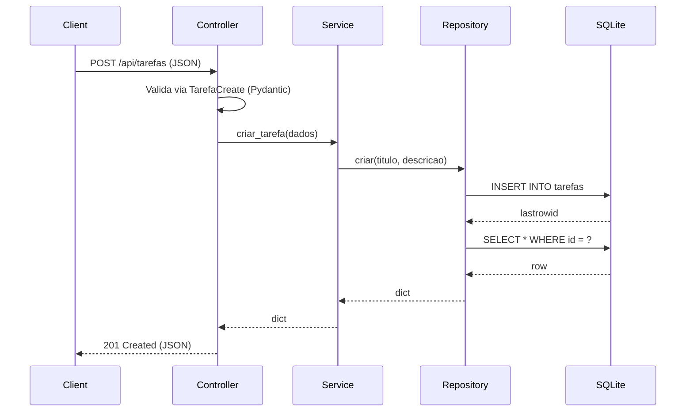
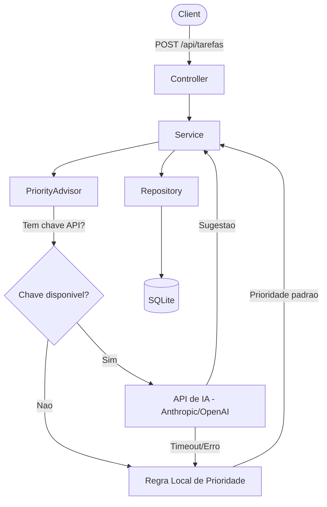

# Arquitetura - Micro-API de Tarefas

## Visao Geral

Micro-API RESTful para gerenciamento de tarefas, construida com FastAPI + Pydantic, seguindo arquitetura em camadas.

## Stack

- **Linguagem:** Python 3.11+
- **Framework:** FastAPI
- **Validacao:** Pydantic
- **Banco de dados:** SQLite
- **Servidor:** Uvicorn

## Diagrama de Camadas

## Estrutura de Diretórios

## Fluxo de uma Requisicao (exemplo: criar tarefa)

## Fluxo Futuro com PriorityAdvisor

## Endpoints da API

| Metodo | Rota | Descricao | Status |
|--------|------|-----------|--------|
| GET | /api/tarefas | Listar todas as tarefas | 200 |
| GET | /api/tarefas/{id} | Buscar tarefa por ID | 200 / 404 |
| POST | /api/tarefas | Criar nova tarefa | 201 / 400 |
| PUT | /api/tarefas/{id} | Atualizar tarefa | 200 / 404 |
| DELETE | /api/tarefas/{id} | Deletar tarefa | 204 / 404 |

## Principios

- **Resiliencia:** IA nunca quebra o fluxo principal do CRUD
- **Coesao:** Cada camada tem responsabilidade unica
- **Testabilidade:** Camadas desacopladas facilitam testes unitarios
